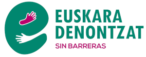

**Euskera** | [Castellano](es)

<h1 id="adierazpena" style="margin-bottom: 10px;padding-bottom: 0;text-decoration: none !important;">EUSKARA DENONTZAT, POR UN EUSKERA SIN BARRERAS</h1>

* [Laburpena](#laburpena)
* [Euskal hizkuntza-politika berritzeari buruzko eztabaidarako 12 proposamen azaltzen dituen testua](#euskal-hizkuntza-politika-berritzeari-buruzko-eztabaidarako-12-proposamen-azaltzen-dituen-testua)
* [Apunta zaitez hemen, kanpainari buruzko informazioa jasotzeko](#apunta-zaitez-hemen-kanpainari-buruzko-informazioa-jasotzeko)

<a href="https://docs.google.com/forms/d/e/1FAIpQLScEcKKbk8gD_PHpn-GfKbukyWDQVaod6czuvYwzLU65Yu_WmA/viewform?usp=sf_link" class="pressbutton">Izena eman</a>

<iframe title="Conocimiento, uso y perfiles lingüísticos por municipio en Euskadi" aria-label="Mapa" id="datawrapper-chart-u0UUA" src="https://datawrapper.dwcdn.net/u0UUA/1/" scrolling="no" frameborder="0" style="width: 0; min-width: 100% !important; border: none;" height="699"></iframe>

## Laburpena

“Euskara denontzat, por un euskera sin barreras”, Euskadiko hizkuntza-politikari buruzko eztabaida oinarri pluralistekin sustatu nahi duen taldea da, euskara denontzat eskuragarri izateko zubiak eraikiz eta harresiak gaindituz. Kontraste eta hedapen jarduerak antolatuko dira.

<!--a href="http://t.me/eraikiz"></a-->

## Euskal hizkuntza-politika berritzeari buruzko eztabaidarako 12 proposamen azaltzen dituen testua

### EUSKARA DENONTZAT, POR UN EUSKERA SIN BARRERAS

(12 proposamen euskal hizkuntza-politika berritzeko)

#### A.- Euskara ikasteko doakotasuna eta liberazioak prezioaren eta denboraren oztopoak gaindituz

##### A.I.- Doakotasuna (prezioaren oztopoa)

> **1. Proposamena**: Euskaltegietako matrikulen prezioa (gaur egun 800 euro inguru, erdia euskaltegi publikoetan ikasten duten ikasleen % 24rentzat) hizkuntza-eskola ofizialetako matrikulekin parekatzea (80 euro), eta gero itzultzea, gutxieneko klasetara joateko baldintzak bete ondoren.

Azalpena: Euskadin bizi den eta euskara ikasi nahi duen pertsona orok (gaur egun 35.000 ikasle urtero) horretarako aukera ekonomikoa izatea, udal bakoitzak eskaintzen dituen aukeren eta baliabideen araberakoa izan beharrean. Hau da, HABEren esparru komun bat izatea, ikastaro horiek hezkuntza orokorraren antzeko baldintzetan modu eskuragarrian egitea erraztuko duena.

##### A.II.- Liberazioak (denboraren oztopoa)

> **2. Proposamena**: Enpresa pribatuetako langileentzat funts publikoekin ordaindutako lan-baimena, euskara ikasteko denbora izateko, sektore publikoan dauden programen ildotik.

Azalpena: Matrikularen zenbatekoa baldintzagarria den bezala euskara ikasteko orduan, denbora izatea ere baldintzagarria da, batez ere lanean ari direnentzat. Ordaindutako enpleguaren orduei etxeko laneko, zaintzako eta aisialdiko orduak gehitzen zaizkie, eta pertsona askori ordutegi tarte txikia uzten zaie euskaltegietara eta HEOetara joan ahal izateko. Gainera, banakako lan asko egin behar da etxean, ikaskuntzan aurrera egin ahal izateko.

#### B.- Ezagutza egiaztatzeko sistema berriak, makro-errebaliden monopolioa gaindituz

##### B.I.- Ebaluazio jarraitua euskaltegietan

> **3. Proposamena**: Ezagutza maila euskaltegietan bertan etengabeko ebaluazioaren bidez egiaztatzeko aukera, HABEk ezarritako ikuskapen arauen arabera.

Azalpena: Hezkuntza sistema osoan normala den bezala, euskara maila baxuenen ziurtagiria (A1, A2) euskaltegietan egiten da jada, hurrengo mailetako gaitasun batzukin egiten den bezala (irakurmena eta entzumena). Irakaskuntza eta ebaluazio egiaztatzailea hurbiltzeko eredu horrek, azterketa makroerrebalidoen monopolioa gainditzen baitu, aukera ematen du ebaluazioak ikasleentzat ezaguna eta egunerokoa den ingurune batean egiteko. HABE sortzeari eta euskaltegiak arautzeari buruzko 29/1983 Legearen 16. artikuluan aurreikusten zen jada haren aplikazioa, “irakasmen-ahalmen osoa” “agiriak edo egiaztagiriak lortzeko egin beharreko saioak eratzeko gaitasunak”.

##### B.II.- Ikasketak, oposizioak eta lanbide jarduna euskaraz eginez egiaztatzea

> **4. Proposamena**: Euskara-maila egiaztatzeko aukera, hautaprobak euskaraz eginez eta zeregin profesionalak euskaraz egin izanaren ziurtagiria aurkeztuz.

Azalpena: Ikasketa ofizialen zati bat euskaraz egiteak euskararen ezagutza egiaztatzeko aukera ematen duen bezala (47/2012 Dekretua), oposizio azterketak euskaraz egitea eta lanpostuaren jardun profesionalaren euskaraz egin izanaraen ziurtagiriak (profesionaltasun-ziurtagiriak) ere ezagutza egiaztatzeko modu gisa erabili beharko lirateke.

#### C.- Ezagutza-aniztasun guztia hizkuntza-eskakizun malguekin aitortzea

##### C.I.- Profil berriak aitortzea: ahozkoa, belarriprest, A1, A2

> **5. Proposamena**: Ahozko hizkuntza-eskakizuna ezartzea (mintzamen gaitasunak bakarrik).

> **6. Proposamena**: Ulermendun/Belarriprest hizkuntza-eskakizuna ezartzea (ulermena bakarrik).

> **7. Proposamena**: A1 eta A2 hizkuntza eskakizunak osorik aitortzea.

Azalpena: Egungo hizkuntza eskakizunen sistemak lau hizkuntza trebetasun aldi berean egiaztatzea eskatzen du (ahozko eta idatzizko ulermena, ahozko eta idatzizko adierazpena). Baina edozein hizkuntza komunitatetan pertsona askok maila desberdinak lortzen dituzte trebetasun bakoitzean, eta, beraz, funtsezkoa da trebetasun bakoitza modu bereizian egiaztatzeko aukera zabaltzea, hala nola Euskaraldian aldarrikatzen den ulermena edo euskaldun agrafoen ahozkotasuna, TOEFL bezalako ziurtagirietan egiten den bezala.

Era berean, lanpostu askok maila asimetrikoak behar dituzte beren eginkizunak betetzeko. Adibidez, autobus gidariak edo egoitzetako zaintzaileak, ez baitute idatzi behar beren zereginak egiteko, baizik eta hitz egiten eta ulertzen jakitea nahikoa izango litzateke. Baina, gaur egun, hizkuntza eskakizunen sistemako lanpostuetan eska daitekeen gutxieneko ezagutza B1etik gorakoa da trebetasun guztietan, A1 eta A2 mailak baloratu gabe (euskaltegietako ikasle guztien % 28k ikasten dute maila hauetan, eta horietatik % 40k Euskal Herritik kanpo dute jatorria).

##### C.II.- Hizkuntza-eskakizuna baldintza gisa

**8. Proposamena**: Egoera soziolinguistiko desberdinak eta hizkuntza ikuspegidun zerbitzuen benetako eskariaren neurketa kontuan hartzea, derrigorrezko hizkuntza eskakizuna duten lanpostuen ehunekoa ezartzeko, EAEko administrazioen zerbitzu publikoetan eta Euskadiko Estatuko Administrazio Orokorrean herritarren arreta bermatzeko, bai zuzeneko prestazioetan, bai kontratu publikoetan.

> **9. Proposamena**: Euskadiko Estatuko Administrazio Orokorrean arreta elebiduna bermatzea, Euskararen erabilera normalizatzeko 10/1982 Oinarrizko Legearen hirugarren xedapen gehigarria betez.

> **10. Proposamena**: Lanpostuetan eska daitezkeen euskara mailak ezartzea, eginkizunen azterketaren arabera, 47/2012 Dekretuan eskatutako ikasketa maila bakoitzerako ezarritako salbuespenak hasierako erreferentziatzat hartuta, eta C2-HE4 mugatuz lanpostuaren funtsezko edukia hizkuntza denerako (itzulpena, hizkuntza-normalizazioa).

Azalpena: Administrazio publikoaren eginbeharra da (bai euskal erakundeena, bai Euskadiko Estatuko Administrazio Orokor ez betetzailearena) nahi dutenei beren lurraldeko hizkuntza ofizialetan arreta ematea, eta, horretarako, hizkuntza-eskakizunak tresna baliagarriak dira. Hala ere, hori bermatzeko ez da beharrezkoa Azpeitiko edo Gasteizko anbulatorioetan derrigorrezko profila duten lanpostuen proportzio bera, pazienteen eskaria oso bestelakoa baita. Hizkuntza eskakizunek hizkuntza hautaketaren berme proportzionala izan behar dute, eta ez dira erabili behar funtzio publikoan sartzeko justifikaziorik gabeko oztopo gisa (are gehiago helduen % 15-20k soilik duenean egiaztatuta normalean eskatzen diren mailak).

Euskadiko Estatuko Administrazio Orokorrak ere elebitasuna errespetatu behar du, eta hizkuntza-koofizialtasuna aplikatu, Europako Kontseiluko Hizkuntza Gutxituen Europako Gutuneko adituek behin eta berriz gogorarazi duten bezala.

##### C.III.- Hizkuntza-eskakizuna merezimendu gisa

> **11. Proposamena**: Hizkuntza eskakizuna merezimendu gisa baloratzeko aukera proportzionalki baloratzea derrigorrezko eskakizuna ez duten lanpostuetan, merezimenduen ataleko portzentajea % 15erainokoa izatea.

Azalpena: Hizkuntza eskakizunak, arreta elebidunerako beharrezkoak diren lanpostuetako eskatzea funtsezko tresna da herritarren hizkuntza hautua bermatzeko. Gainera, merezimendu gisa baloratzea zentzuzkoa da, baldin eta pisu erabakigarria ez badu, eta de facto eskakizun bihurtzen ez bada derrigorrezko hizkuntza eskakizunik ez duten lanpostuetan ere.

#### D.- Azterketa soziolinguistikoetan klase, genero eta jatorriaren ikuspegia bermatzea

> **12. Proposamena**: Azterketa soziolinguistikoak egiteko garaian, klasearen eta jatorriaren ikuspegia sartzea, genero ikuspegiaz gain.

Azalpena: Genero ikuspegiak erabateko berdintasuna lortzeko politika publikoak orientatzeko orduan laguntzen duen bezala, kontuan hartu behar dira klasearen eta jatorriaren ikuspegiak politika publikoak egiterakoan. Batez ere, hizkuntzarekin zerikusia duten politiketan, egiaztatzen dutenen eta ez dutenen artean zatiketa soziala saihesteko, desberdintasuna eta galtzaileen/irabazleen logika eragin baitezake gizarte-arrakala toxiko bat.

## Apunta zaitez hemen, kanpainari buruzko informazioa jasotzeko

<a href="https://docs.google.com/forms/d/e/1FAIpQLScEcKKbk8gD_PHpn-GfKbukyWDQVaod6czuvYwzLU65Yu_WmA/viewform?usp=sf_link" class="pressbutton">Izena eman</a> 

<meta property="og:title" content="adierazpena">

