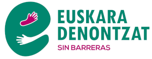

[Euskera](/) | [Castellano](es)

<h1 id="euskaradenontzat" style="margin-bottom: 10px;padding-bottom: 0;text-decoration: none !important;">EUSKARA DENONTZAT, POR UN EUSKERA SIN BARRERAS </h1>

## En defensa del derecho a organizarse frente a abusos en la aplicación de perfiles lingüísticos
<iframe src="Comunicado_ante_la_informacion_publicada_en_Argia_Euskara_denontzat.pdf" width="100%" height="600px">
  <a href="Comunicado_ante_la_informacion_publicada_en_Argia_Euskara_denontzat.pdf">Descarga PDF</a>
</iframe>

<meta property="og:title" content="euskaradenontzat">

