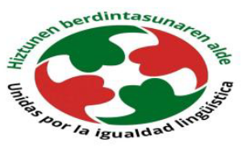

[Euskera](Argiak_argitaratutako_informazioaren_inguruko_komunikatua) | Castellano

<h1 id="euskaradenontzat" style="margin-bottom: 10px;padding-bottom: 0;text-decoration: none !important;">EUSKARA DENONTZAT, POR UN EUSKERA SIN BARRERAS </h1>

## En defensa del derecho a organizarse frente a abusos en la aplicación de perfiles lingüísticos

*11-03-2026*

Ante las informaciones publicadas recientemente en torno a nuestra actividad, queremos aclarar varias cuestiones.
Mientras una parte de los responsables políticos ignoran en la práctica los índices de obligado cumplimiento establecidos por la normativa, se producen situaciones que pueden derivar en exclusiones laborales o en decisiones posteriormente cuestionadas en los tribunales. Al mismo tiempo, muchas personas afectadas ni siquiera se atreven a pedir en los tribunales que se respeten sus derechos y la normativa lingüística vasca.

**“Nuestro trabajo consiste en acompañar a ciudadanos que piden algo tan básico como que se cumpla la normativa vigente.”**

En los últimos años hemos ayudado a personas que se encontraban desorientadas o atemorizadas ante perfiles lingüísticos que consideran abusivos. Si la ley actual se cumpliera con claridad, muchas de las personas afectadas no habrían acudido a Euskara Denontzat, por un euskera sin barreras y Unidas por la igualdad lingüística en Osakidetza pidiéndonos apoyo. Aunque finalmente se trate de un número reducido de casos, la cuestión se enmarca en un debate más amplio, reflejado también en el centenar de recursos judiciales que distintos medios han señalado en relación con esta materia.

**“Muchas personas afectadas ni siquiera se atreven a acudir a los tribunales para reclamar sus derechos”**

Eso mismo ocurrió en Errenteria, en una convocatoria que exigía PL3-C1 (antes EGA) en el 100 % de las plazas de administrativo, pese a que el índice de obligado cumplimiento era del 53 %. Una persona afectada pidió nuestra ayuda porque no se atrevía a recurrir. Hablamos con personas ya apuntadas con PL2-B2, interesadas en participar y en dar la cara para que se cumplan las proporciones lingüísticas en vigor. Para que también el 83 % de vascos que no tienen el PL3-C1 puedan acceder al empleo público. Finalmente, solo una persona decidió recurrir tras más de 22 años de interinidad.

**“En Errenteria no hubo ninguna conspiración: sino organización ciudadana con el objetivo de que el 83 % de vascos que no tienen el PL3-C1 puedan también acceder al empleo público.”** 

No hay ninguna conspiración detrás de estos hechos: lo que existe es organización ciudadana. Hemos llevado nuestras reivindicaciones a los diferentes medios y actores que nos han citado y hasta hemos acudido al Parlamento Vasco a explicarlo. Somos una organización que busca evitar posibles abusos administrativos y acompañar a personas que reclaman que se respeten sus derechos, además de proponer puentes para que el euskera avance mediante la gratuidad y políticas lingüísticas más inclusivas. 

En este contexto, el medio Argia ha optado por publicar capturas de mensajes personales procedentes de un grupo de WhatsApp, trasladando el debate a un terreno que consideramos poco constructivo. En esos mensajes, precisamente, se puede leer el miedo de algunas personas a presentar recursos. Resulta especialmente llamativo que un medio que recibe financiación pública para promover el euskera termine señalando a personas que se organizan públicamente para ayudar a ciudadanos frente a posibles abusos administrativos y frente al miedo a ejercer sus derechos.

**“Publicar mensajes privados mientras se señala a quienes ayudan a ejercer derechos no contribuye a un debate público serio.”**

Quien sí oculta información, en una decisión editorial que, a nuestro juicio, plantea dudas sobre el enfoque informativo adoptado, es Argia. Cuando nos contactaron requirieron la afiliación sindical de las personas señaladas públicamente —provenientes de ELA y CCOO respectivamente— que actúan como ciudadanos independientes. Sin embargo, ese dato no ha sido publicado.

Resulta preocupante una lógica que termina señalando a quienes, desde abajo, ayudan a que se respeten los derechos lingüísticos y laborales previstos en la normativa vigente sobre perfiles lingüísticos, mientras se presenta como víctimas a responsables políticos cuyas decisiones han sido cuestionadas en distintos ámbitos.

**“Seguiremos proponiendo el avance del euskera mediante puentes como la gratuidad de los euskaltegis o medidas que faciliten el aprendizaje al personal interino y del sector privado.”**

Instamos a debatir pública y democráticamente con los agentes y medios que nos señalan, en algunos casos sin contrastar suficientemente la información y recurriendo a descalificaciones. Seguiremos proponiendo el avance del euskera mediante puentes como la gratuidad de los euskaltegis o medidas que faciliten el aprendizaje del idioma al personal interino y del sector privado, sin muros de exigencias ilegales o discriminatorias. Porque el euskera es mucho más que los perfiles lingüísticos.

**Aprovechamos para decir a toda la ciudadanía vasca que sienta miedo frente a posibles abusos que se ponga en contacto con estas entidades. No nos intimidan y seguiremos ayudando a quien lo necesite.**

Sabin Zubiri   | Teresa Perales 

<iframe src="Comunicado_ante_la_informacion_publicada_en_Argia_Euskara_denontzat.pdf" width="100%" height="600px">
</iframe>
<a href="Comunicado_ante_la_informacion_publicada_en_Argia_Euskara_denontzat.pdf">Descarga PDF</a>

<meta property="og:title" content="euskaradenontzat">

