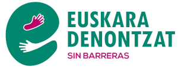
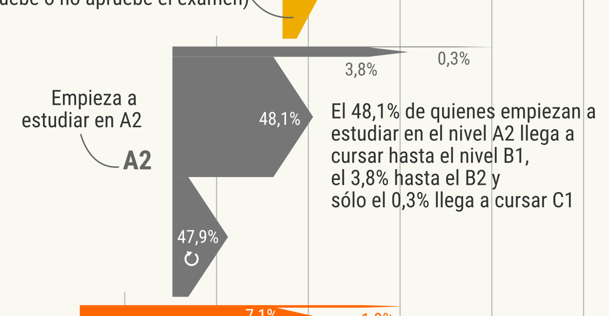
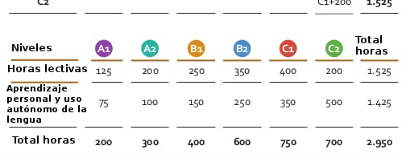
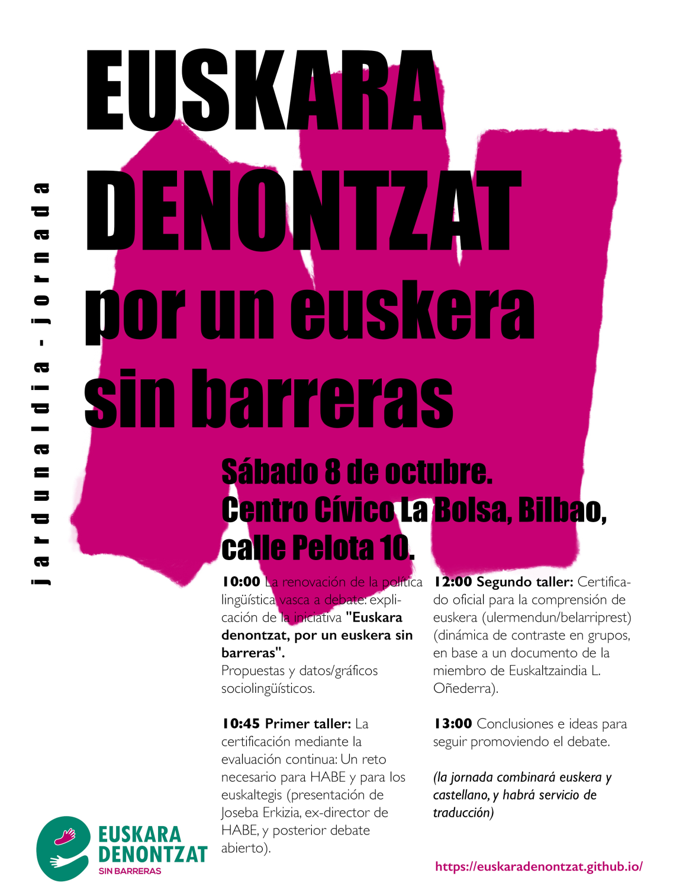

[Euskera](/) | **Castellano**

<h1 id="euskaradenontzat" style="margin-bottom: 10px;padding-bottom: 0;text-decoration: none !important;">EUSKARA DENONTZAT, POR UN EUSKERA SIN BARRERAS </h1>

* [Resumen](#resumen)
* [Texto explicativo de 12 propuestas para debatir sobre la renovación de la política lingüística vasca](#texto-explicativo-de-12-propuestas-para-debatir-sobre-la-renovación-de-la-política-lingüística-vasca)
* [Actividades](#actividades)
* [Noticias](alb)
* [Metodología y datos](metod)
* [Para recibir información sobre esta campaña, apúntate aquí ](#para-recibir-información-sobre-esta-campaña-apúntate-aquí)

<a href="https://docs.google.com/forms/d/e/1FAIpQLScEcKKbk8gD_PHpn-GfKbukyWDQVaod6czuvYwzLU65Yu_WmA/viewform?usp=sf_link" class="pressbutton">Recibir información</a>

<iframe title="Conocimiento, uso y perfiles lingüísticos por municipio en Euskadi" aria-label="Mapa" id="datawrapper-chart-u0UUA" src="https://datawrapper.dwcdn.net/u0UUA/1/" scrolling="no" frameborder="0" style="width: 0; min-width: 100% !important; border: none;" height="699"></iframe>

## Resumen

“Euskara denontzat, por un euskera sin barreras” es un grupo que quiere promover un debate propositivo sobre la política lingüística en Euskadi en clave pluralista, construyendo puentes para que el euskera sea accesible para toda la población y superando barreras. Se van a organizar distintas actividades de contraste y difusión.
 
## Texto explicativo de 12 propuestas para debatir sobre la renovación de la política lingüística vasca

### EUSKARA DENONTZAT, POR UN EUSKERA SIN BARRERAS

(12 propuestas para renovar la política lingüística vasca)

#### A.- Gratuidad y liberaciones para aprender euskera superando las barreras del dinero y del tiempo

##### A.I.- Gratuidad (barrera precio)

> **Propuesta 1**: Equiparar el precio de las matrículas de los euskaltegis (actualmente en torno a 800 euros y sobre la mitad para el 24% del alumnado que estudia euskaltegis públicos) a las de las escuelas oficiales de idiomas (80 euros), con devolución posterior tras el cumplimiento de los requisitos de asistencia mínima.

Explicación: Que toda persona residente en Euskadi que quiera aprender euskera (actualmente 35.000 estudiantes al año) tenga la posibilidad económica de hacerlo en vez de depender de la disposición y recursos que destine cada ayuntamiento. Es decir, la existencia de un marco común de HABE que facilite realizar dichos cursos de manera accesible en condiciones similares a la educación general.

<figure>

<figcaption>La realidad del aprendizaje del euskera en los euskaltegis: niveles inicial y final cursados en HABE por cada estudiante en todo el período 2009/2019. <a href="img/aprendizaje_euskltegis_habe_2009-2019_es.png">Pulsa para ver a tamaño completo</a>.</figcaption>
</figure> 
 
##### A.II.- Liberaciones (barrera del tiempo)

> **Propuesta 2**: Permiso laboral retribuido con fondos públicos para trabajadores de las empresas privadas, con el objetivo de disponer de tiempo para estudiar euskera, en la línea de los programas ya existentes en el sector público.

Explicación: Así como la cuantía de la matrícula resulta condicionante a la hora de poder estudiar euskera, la disponibilidad de tiempo también lo es, especialmente para quienes están trabajando. A las horas del empleo remunerado se le suman las horas de trabajo doméstico, de cuidados, de ocio, dejando a muchas personas poco margen horario para poder asistir a los euskaltegis y EOIs. Además se necesita mucho trabajo individual en casa para poder avanzar en el aprendizaje.

<figure>

<figcaption>Horas de enseñanza y horas de aprendizaje (teóricas).<a href="img/tabla_horas_es.jpeg">Pulsa para ver a tamaño completo</a>.</figcaption>
</figure> 

 
#### B.- Nuevos sistemas de acreditación del conocimiento, superando el monopolio de las macro-reválidas

##### B.I.- Evaluación continua en euskaltegis

> **Propuesta 3**: Posibilidad de acreditar el nivel de conocimiento mediante evaluación continua en los propios euskaltegis, bajo las normas de supervisión establecidas por HABE.

Explicación: Como es normal en todo el sistema educativo, la certificación de los niveles mas bajos de euskera (A1, A2) ya se realiza en los euskaltegis, de igual forma que algunas de las competencias en los siguientes niveles (comprensión lectora y oral). Este modelo de acercar la enseñanza y la evaluación acreditativa, superador del monopolio de los exámenes macro-reválida, permite realizar las evaluaciones en un entorno conocido y cotidiano para el alumnado. Su aplicación ya se preveía en el artículo 16 de la Ley 29/1983 de creación de HABE y regulación de los euskaltegis, “plenas facultades académicas” “para realizar las pruebas cuya superación permita obtener los diplomas o certificados”.

 
##### B.II.- Acreditación mediante realización estudios, oposiciones y desempeño profesional en euskera

> **Propuesta 4**: Posibilidad de acreditar el nivel de euskera mediante la realización de las pruebas selectivas en euskera y la certificación del desempeño de tareas profesionales en euskera.

Explicación: Al igual que la realización de una parte de los estudios oficiales en euskera ya permite acreditar su conocimiento de euskera (Decreto 47/2012), la realización de exámenes de oposición en euskera y los certificados de desempeño profesional del puesto de trabajo en euskera (certificados de profesionalidad) también debería servir como forma de acreditación de conocimiento.

#### C.- Reconocer con perfiles lingüísticos flexibles toda la diversidad de conocimientos

##### C.I.- Reconocimiento de nuevos perfiles: Oral, Belarriprest, A1, A2

> **Propuesta 5**: Creación de perfil lingüístico oral (solo competencias orales).

> **Propuesta 6**: Creación de perfil lingüístico Ulermendun/Belarriprest (solo comprensión).

> **Propuesta 7**: Reconocimiento pleno de los perfiles lingüísticos A1 y A2.

Explicación: El sistema actual de perfiles exige acreditar simultáneamente cuatro competencias lingüísticas (comprensión oral y escrita, expresión oral y escrita). Pero en cualquier comunidad lingüística muchas personas alcanzan diferentes niveles en cada competencia, por lo que es clave abrir la posibilidad de acreditación diferenciada de cada competencia, como por ejemplo la comprensión que se reivindica en el Euskaraldia, o la oralidad de los euskaldunes ágrafos, tal y como se hace en certificados como TOEFL.

Asimismo muchos puestos de trabajo requieren niveles asimétricos para desarrollar sus funciones. Como por ejemplo los conductores de autobús o cuidadoras de residencias, que no necesitan redactar para la realización de sus tareas, sino que con saber hablar y entender sería suficiente. Pero actualmente el conocimiento mínimo exigible en los puestos de trabajo del sistema de perfiles es a partir de B1 en todas las competencias, sin tan siquiera valorar los niveles A1 y A2 (dónde estudian el 28% del alumnado total de los euskaltegis, de los que un 40% proviene de fuera de Euskal Herria).
 
##### C.II.- Perfil lingüístico como requisito proporcionado

> **Propuesta 8**: Tomar en cuenta las distintas realidades sociolingüísticas y la medición de la demanda efectiva de servicios con perspectiva lingüística para establecer el porcentaje de puestos de trabajo con perfil lingüístico preceptivo para garantizar la atención de la ciudadanía en los servicios públicos de las administraciones públicas, tanto en los de prestación directa como en las contratas públicas.

> **Propuesta 9**: Garantizar la atención bilingüe en la Administración General del Estado en Euskadi, haciendo cumplir por fin la disposición adicional tercera de la Ley 10/1982, básica de normalización del uso del euskera.

> **Propuesta 10**: Establecer los niveles de euskera exigibles en los puestos de trabajo de acuerdo al análisis de las funciones, tomando como referencia inicial las exenciones del Decreto 47/2012 para cada nivel de estudios requerido (B1 ESO, B2 Bachillerato, C1 Grado Universitario), acotando el C2-PL4 para aquellos dónde la lengua sea el contenido esencial del puesto (traducción, normalización lingüística).

Explicación: El deber de la administración pública (tanto de las instituciones vascas, como de la incumplidora Administración General del Estado en Euskadi) es el de atender a quienes lo deseen en los idiomas oficiales en su territorio, y para ello los perfiles lingüísticos son un instrumento útil. Sin embargo para garantizarlo no es necesaria la misma proporción de puestos con perfil obligatorio en un ambulatorio de Azpeitia o de Vitoria-Gasteiz, porque la demanda de los pacientes es considerablemente distinta. Y los perfiles deben ser una garantía proporcionada de la elección lingüística, y no ser utilizada como una barrera injustificada para el acceso a la función pública (más aún cuando sólo un 15-20% de la población adulta tiene acreditado los niveles generalmente exigidos).

La AGE en Euskadi también debe respetar el bilingüismo y aplicar la cooficialidad lingüística, tal y como lo han recordado reiteradamente los expertos de la Carta europea de lenguas minoritarias, del Consejo de Europa. 

##### C.III.- Perfil lingüístico como mérito proporcionado

> **Propuesta 11**: Ponderar proporcionalmente la valoración del perfil lingüístico como mérito en el acceso a los puestos que no lo tienen como requisito, como una porcentaje del apartado de méritos de hasta el 15%.

Explicación: Los perfiles como requisito en los puestos de trabajo necesarios para la atención bilingüe es el instrumento fundamental para garantizar la elección lingüística de la ciudadanía. Valorarlo además como mérito es razonable, siempre que no se le de un peso decisivo, convirtiéndolo en una exigencia de facto también en aquellos puestos sin perfil preceptivo.

#### D.- Garantizar la perspectiva de clase, género y origen en los estudios sociolingüísticos
 
> **Propuesta 12**: Incluir visión de clase y origen, además de la ya incorporada de género, a la hora de realizar estudios sociolingüísticos.

Explicación: De igual manera que la perspectiva de género ayuda a la hora de orientar las políticas públicas para tratar de lograr una plena igualdad, se deben de tomar en cuenta las perspectivas de clase y origen a la hora de realizar las políticas públicas. Especialmente en aquellas que tengan que ver con el idioma, para evitar una división social dentro de la ciudadanía vasca entre los que acreditan perfil y los que no, que puede provocar desigualdad y una lógica de perdedores/ganadores, una tóxica brecha social.

<iframe style='width: 100%; height: 700px; max-width: none; overflow: hidden; border: 1px solid white;' src='https://numeroteca.org/euslang/par/index.html'></iframe>
 
## Actividades

### Presentación de la actividad

**8 de octubre 2022**
Hora: 10:00h.
La Bolsa. Cale Pelota 10. Bilbao.

 
## Para recibir información sobre esta campaña, apúntate aquí 

<a href="https://docs.google.com/forms/d/e/1FAIpQLScEcKKbk8gD_PHpn-GfKbukyWDQVaod6czuvYwzLU65Yu_WmA/viewform?usp=sf_link" class="pressbutton">Recibir información</a> 

<meta property="og:title" content="euskaradenontzat">

